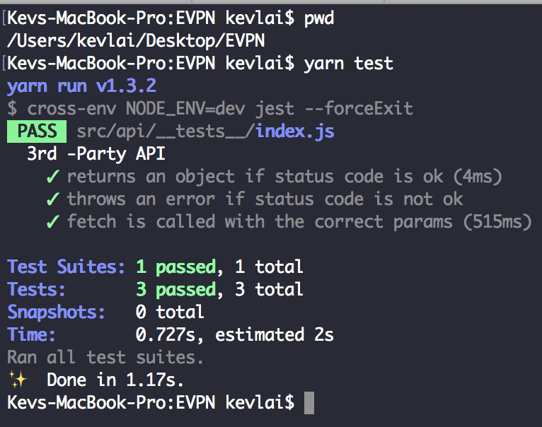

## Preparation
Make sure you have `npm` or `yarn` installed on your machine, and then inside the project directory, executing the following command to install the dependencies:

```shell
npm install

----- OR -----

yarn install
```

## Project Structure

There are only two files in the project (not count `package.json`):
- /src/api/index.js
- /src/api/__tests__/index.js

The first contains the real code that GET/POST data. The second one contains the tests.

For the explanations of myt code, I've already written them in comments along the tests in steps. Step 3, 4 and 6 are really relevant, I'm just including them here for completion's sake and also found them interesting.

## Execution

To execute the tests, simply execute the following command inside the project directory:

```shell
npm run test

----- OR -----

yarn test
```

And you should be able to see some results like this:

